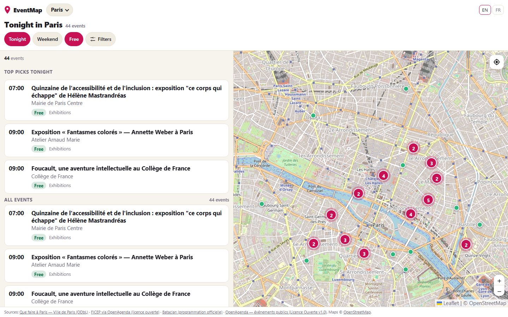

# EventMap

[](https://github.com/flemops/eventmap.hamdy-tabsissi.com/actions/workflows/ci.yml)
[](https://github.com/flemops/eventmap.hamdy-tabsissi.com/actions/workflows/prod-tag.yml)

**"What should I do tonight?" — one answer, not a catalogue.** EventMap aggregates public cultural
events, de-duplicates them across sources, and opens on *tonight in your city* (free events first, no location permission needed) instead of an
endless list. It is built as a small, operable production service: polite multi-source ingestion,
reversible de-duplication, strict health checks, and a CI gate in front of every deploy.

[**Live demo**](https://eventmap.hamdy-tabsissi.com) ·
[API docs](https://eventmap.hamdy-tabsissi.com/api/docs) ·
[Health](https://eventmap.hamdy-tabsissi.com/health) ·
[Architecture](#architecture) ·
[Run locally](#run-it-locally)

<p align="center"></p>
<p align="center"></p>
<sub>Screenshots of the live service (production), captured on 07/10/2026 with Playwright.</sub>

> Documentation under [`docs/`](docs/) is written in French (the product and its sources are French);
> this README is the English entry point.

## What makes it technically interesting

| Highlight | Proof |
|---|---|
| **Fault tolerance with last-known-good data**: a failing or silent source never empties the map | decisions [D6](docs/decisions.md), [D7](docs/decisions.md) · `test_invariant_last_known_good_*` |
| **Strict health, availability ≠ data quality**: `/health` is always 200; `/health?strict=1` returns 503 with named alerts | [`main.py`](main.py) `compute_alerts` · [`surveillance.yml`](.github/workflows/surveillance.yml) opens/closes a GitHub issue |
| **Multi-source ingestion**: iCalendar (RRULE/EXDATE), JSON-LD, Opendatasoft, one open-data API; per-source cadence, timeout, retries, rate limit | [`registry.py`](registry.py), [`feeds.yaml`](feeds.yaml), [`sources*.py`](sources.py) |
| **Reversible cross-source de-duplication** (strong / weak / translation matches; nothing deleted) | [`docs/multi-ville.md`](docs/multi-ville.md) · D15 |
| **Config-driven multi-city engine**: no `if city == …` in the code; a city is one YAML entry; a dark-launched city is invisible to the API | [`cities.yaml`](cities.yaml) · `test_une_requete_paris_ne_renvoie_jamais_jeddah` |
| **Defence in depth**: SSRF guard on every redirect, text sanitising, nginx limits and CSP, hardened systemd unit | [`safety.py`](safety.py), [`deploy/`](deploy/) |
| **CI/CD with a real gate**: lint, tests + coverage floor, dependency audit + SBOM, secret scan, Python 3.12/3.13 matrix; the `prod` tag only moves after a green gate; post-deploy check compares the live commit | [`.github/workflows/`](.github/workflows/) · [`docs/release.md`](docs/release.md) |
| **Measured, not assumed**: reproducible benchmark and the thresholds that would justify leaving SQLite | [`deploy/bench.py`](deploy/bench.py) · [`docs/performance.md`](docs/performance.md) · [`docs/scaling.md`](docs/scaling.md) |

## Why this project exists

Event apps optimise for browsing. The real question is *"what do I do tonight, close to me?"* — and a
long list answers it badly. EventMap's constraint is **no choice paralysis**: the default view is
tonight in the chosen city, free events by default (configurable per city), distances shown only if you share your location; wider windows, categories and filters are one tap away.
That product constraint drives the engineering: the answer is only trustworthy if duplicates are
merged, cancelled events disappear, stale data is flagged, and an outage is never mistaken for
"nothing on tonight".

## Architecture

```mermaid
flowchart LR
    subgraph Sources["Public sources (feeds.yaml)"]
        A1["Open-data API<br/>(Paris, ODbL)"]
        A2["iCalendar feed"]
        A3["JSON-LD pages"]
        A4["Opendatasoft dataset"]
    end
    subgraph Ingest["Ingestion — refresh loop (separate thread for writes)"]
        B1["Connector<br/>polite HTTP · 1 req/s/domain<br/>timeout · retries · ETag"] --> B2["Normalise<br/>sanitise · venue reference<br/>status · SSRF guard"]
        B2 --> B3["Upsert<br/>UNIQUE(source, source_id, start)"]
        B3 --> B4["Cross-source de-dup<br/>(reversible: doublon_de)"]
        B4 --> B5["Link check"]
    end
    DB[("SQLite · WAL<br/>city_id on every read")]
    subgraph Serve["Serving"]
        C1["FastAPI<br/>/api/events · /api/cities · /health"]
        C2["Server-rendered pages<br/>+ vanilla JS · Leaflet"]
    end
    N["nginx<br/>TLS · CSP · rate limit"]
    M["Monitoring<br/>/health?strict=1 → GitHub Actions → issue"]
    Sources --> B1
    B5 --> DB
    DB --> C1
    DB --> C2
    C1 --> N
    C2 --> N
    N --> U(("Users"))
    C1 -. alerts .-> M
    SD["systemd<br/>(sandboxed unit, CPU/RAM caps)"] -. runs .- Serve
```



Stack: **Python 3.12+ · FastAPI · SQLite (WAL) · vanilla HTML/CSS/JS · Leaflet/OpenStreetMap · nginx · systemd ·
GitHub Actions.** No build step, no front-end framework, no external service to run it.

### Data pipeline

1. **Connector** (one per source, declared in `feeds.yaml`) fetches politely and *raises* on failure; it never
   returns an empty list to hide an error ([D6](docs/decisions.md)).
2. **Normalise** (`pipeline.py`, `safety.py`): strip markup, refuse unsafe URLs, attach the venue from a
   reference file only when the source gives no coordinates, derive status (cancelled / postponed) from the title.
3. **Upsert**, idempotent, one row per real time slot (a series is never stretched over its date range).
4. **De-duplicate across sources**: the higher-priority source wins; the loser is marked, never deleted.
5. **Serve**: every read carries a `city_id`; windows ("tonight", "weekend") are computed in the city's time zone.

## Reliability and failure handling

* **Last-known-good**: a source that fails — or answers 200 with nothing — keeps its previous content
  ([D7](docs/decisions.md)); stale data is computed at read time and *shown as stale*, not hidden.
* **Availability vs data**: `/health` always answers 200 while the service runs; data problems appear in
  `alerts` and make `/health?strict=1` return 503 (stalled refresh, failed cycle, never ingested, repeated
  errors, silent source, stale data, missing geocoding). The UI tells "no events" from "data outage".
* **Isolation**: sources and cities have independent cadence, timeout, retries (exponential back-off with jitter) and
  kill-switches (`EVENTMAP_SOURCES_DISABLED`, `EVENTMAP_CITIES_DISABLED`).
* **Circuit breaker, quarantine, disk guard** (all deterministic, no LLM): a source that keeps failing is cut for 6 h
  (doubling up to 24 h) then probed until two consecutive successes; an abnormal batch (volume collapse, geocoding
  break) is quarantined while the last healthy content stays served; a refresh is suspended when the disk is nearly full.
  Alerts stay quiet for self-healing failures ([D22/D23](docs/decisions.md)). Daily per-source health history:
  `GET /api/health/history`. The few cases that need a human are in the [runbook](docs/runbook.md).
* **Responsiveness**: the heavy write phase of a refresh runs in a worker thread, so the API (and `/health`)
  stays live during ingestion.
* **Additive migrations**: an older release keeps working on a migrated database, so a rollback is safe
  (`test_un_ancien_code_continue_d_ecrire_dans_une_base_migree`).

## Tests, CI/CD and monitoring

* **Tests** (offline, `pytest`): risk-based map in [`docs/tests.md`](docs/tests.md) — connector contracts on real
  upstream records, migrations (including *old code on a migrated database*), invariants (city isolation, no visible
  duplicate, last-known-good, no naive dates), health and alerts. Coverage is measured; the CI enforces a floor.
* **Browser tests** ([`tests/e2e/`](tests/e2e/), Chromium via Playwright, throw-away database): first visit → Tonight, filters,
  event panel and shared links, My Evening (overlap, shared link, `.ics`), saved events, hard data cases (invalid external
  link, ended event, duplicate, multi-date series) and an axe-core accessibility scan at 1440 / 1280 / 1024 / 390 px
  ([`e2e.yml`](.github/workflows/e2e.yml)).
* **CI on every PR** ([`ci.yml`](.github/workflows/ci.yml)): Ruff, tests + coverage, Python 3.12 / 3.13, `pip-audit` +
  SBOM, gitleaks. **On `master`** ([`prod-tag.yml`](.github/workflows/prod-tag.yml)): the same checks on the production
  Python, a "production dependencies alone are enough" check, then the `prod` tag moves and the VM pulls it. The reusable gate is the public [`flemops/ci-templates`](https://github.com/flemops/ci-templates).
* **Post-deploy verification** ([`post-deploy.yml`](.github/workflows/post-deploy.yml)): waits for the expected commit to be
  live (`/health` → `release.commit`), then replays [`deploy/verify_prod.py`](deploy/verify_prod.py) read-only against production.
* **Monitoring**: a scheduled workflow ([`surveillance.yml`](.github/workflows/surveillance.yml)) probes `/health` (availability)
  and `/health?strict=1` (data) on a two-hour cron (GitHub schedules are best-effort) and opens / comments / closes a GitHub issue — one alert, one conversation.

## Security and privacy

Only controls that exist in the repository:

* Service binds to `127.0.0.1`; **nginx** terminates TLS, applies `limit_req` on `/api/` and denies `/api/refresh`
  ([`deploy/nginx/`](deploy/nginx/)); security headers and a CSP with `script-src 'self'` (no inline script, no CDN).
* **systemd** unit: dedicated user, `NoNewPrivileges`, `ProtectSystem=strict` with a single writable path,
  restricted address families, memory and CPU caps ([`deploy/eventmap.service`](deploy/eventmap.service)).
* **SSRF guard** on every outgoing URL *and every redirect*; scraped text is sanitised and HTML-escaped on output.
* nginx access logs use a truncated-IP format; there are no accounts and no personal data on the server — the browser keeps only preferences (city, language, saved events) in `localStorage`.
* CI: secret scan, dependency audit, SBOM, Dependabot for Python dependencies and GitHub Actions/reusable workflows, third-party Actions pinned to commit SHAs (enforced by a test).

## Data sources and licensing

The **code licence** and the **data licences** are separate things.

* **Data**: each source's licence and attribution are recorded in [`feeds.yaml`](feeds.yaml) and
  [`docs/sources.md`](docs/sources.md): Que faire à Paris (ODbL, City of Paris), the OpenAgenda public-events
  dataset on Opendatasoft (Licence Ouverte v1.0), the FICEP agenda feed, and a venue's own programme page
  (title, date, place and a link back only). Attribution is shown in the app.
* **Policy**: no scraping without explicit rights. Sources whose terms forbid reuse are *declared and disabled*
  with the evidence, so the decision is auditable ([`docs/jeddah-sources.md`](docs/jeddah-sources.md)).
* **Code**: [MIT](LICENSE) (chosen 07/10/2026; options considered in [`docs/public-readiness.md`](docs/public-readiness.md)).
  Data licences stay those of each source.

## Trade-offs and decisions

Full log with context and consequences: [`docs/decisions.md`](docs/decisions.md). In short:

* **SQLite, not PostgreSQL**: one writer, read-mostly, tens of thousands of rows; measured in
  [`docs/performance.md`](docs/performance.md), with the thresholds that would change my mind in
  [`docs/scaling.md`](docs/scaling.md).
* **One process, an in-process refresh loop, not a queue and workers**: failure isolation is per source, not per
  process; a second process adds operations without removing a measured problem.
* **No scraper without rights**; the optional LLM extractor is off by default and never automatic ([D11](docs/decisions.md)).
* **Vanilla front end**: a map and a list do not need a build chain; the CSP stays strict because there is nothing to inline.
* **Lint but no auto-formatter, a coverage *floor* not a target, no `src/` re-layout**: see [D19](docs/decisions.md).

## Incidents and lessons learned

* **API frozen for ~45 s during ingestion** — the write phase ran on the event loop. It now runs in a worker
  thread; a test fails if the loop is blocked (`test_la_phase_d_ecriture_du_refresh_ne_gele_pas_la_boucle`).
* **nginx security headers silently dropped** — an `add_header` in a `location` replaces inherited ones.
  Headers now live in one included snippet per concern ([`deploy/nginx/eventmap.conf`](deploy/nginx/eventmap.conf)).
* **Deployed, yet the browser ran old JavaScript** — the CDN cached static assets for hours. Scripts now carry a
  content hash in their URL ([D17](docs/decisions.md)); verification is done in a real browser, not only with `curl`.

## How I would scale it

Today: one process, one SQLite file, one VM. Conditional next steps — PostGIS, a task queue, caching, a CDN — are
tied to **measured thresholds** (latency p95, rows per city, write contention, cycle duration) in
[`docs/scaling.md`](docs/scaling.md). None is implemented, because none is needed yet.

## Known limits and roadmap

* **One city is live (Paris).** A second (Jeddah) is built and tested but **off**: no source is authorised in
  writing yet ([`docs/jeddah-sources.md`](docs/jeddah-sources.md)). Reopening criterion: a written authorisation or
  a licensed API.
* Some venues are deliberately not integrated (terms or technical blockers, evidence in [`docs/sources.md`](docs/sources.md)).
* The production VM runs Python 3.12 (migrated from 3.10 on 07/10/2026, rollback and procedure in
  [`docs/python-runtime.md`](docs/python-runtime.md)).
* Browser tests cover the main journeys, not pixel-level visual regression or a real screen reader (manual); single node, no high
  availability. On a throttled CPU (×4) the first event card takes about 11 s ([`docs/performance.md`](docs/performance.md)):
  a mobile-performance pass is the next step.
* Branch protection on `master` requires four green checks (lint + tests/coverage on 3.12, tests on 3.13, secret scan, dependency audit + SBOM) but no pull-request review: a single maintainer, so no second reviewer exists. Verified through the GitHub API on 07/10/2026.

## Run it locally

Requirements: Python 3.12+, Git.

```bash
git clone https://github.com/flemops/eventmap.hamdy-tabsissi.com.git && cd eventmap.hamdy-tabsissi.com
python -m venv .venv && . .venv/bin/activate        # Windows: .venv\Scripts\activate
pip install -r requirements-dev.txt                 # runtime + dev tools (pytest, ruff, coverage, pip-audit)
pytest                                              # offline test suite
pip install -r requirements-e2e.txt && playwright install chromium && pytest tests/e2e   # real-browser journeys + axe (optional)
ruff check .                                        # lint
uvicorn main:app --reload                           # http://127.0.0.1:8000 (first refresh starts after ~5 s)
```

`/health` shows ingestion state; `POST /api/refresh` (localhost only) forces a cycle.

Quality gate, exactly as in CI:

```bash
ruff check . && pytest --cov --cov-fail-under=78    # coverage floor, see docs/decisions.md D19
python deploy/bench.py --budget                     # optional: performance regression check
```

Production deployment, operations and rollback: [`deploy/install.sh`](deploy/install.sh),
[`docs/release.md`](docs/release.md), [`docs/multi-ville.md`](docs/multi-ville.md).

### Environment variables

| Variable | Role | Default |
|---|---|---|
| `EVENTMAP_DB` | SQLite path | `data/eventmap.db` |
| `EVENTMAP_FEEDS` | Sources file | `feeds.yaml` |
| `EVENTMAP_REFRESH_SECONDS` | Refresh loop interval | `21600` (6 h) |
| `EVENTMAP_HORIZON_DAYS` | Ingestion window | `90` |
| `EVENTMAP_CONTACT` | URL put in the HTTP `User-Agent` | repository URL |
| `EVENTMAP_LOG` | Log level | `INFO` |
| `EVENTMAP_CITIES_ENABLED` / `EVENTMAP_CITIES_DISABLED` | Switch cities on / off (off wins) | from `cities.yaml` |
| `EVENTMAP_SOURCES_DISABLED` | Comma-separated source ids to switch off | — |
| `OPENAGENDA_KEY`, `ANTHROPIC_API_KEY` | Optional connectors, unused in the live configuration | — |

## Repository map

```
main.py            FastAPI routes, refresh loop, /health + alerts        cities.py / cities.yaml   city definitions
db.py              schema, additive migrations, idempotent upsert, search registry.py / feeds.yaml  sources + policy
sources*.py        HTTP client, connectors (ICS, JSON-LD, ODS, open data) pipeline.py, safety.py   normalise, SSRF
render.py          server-side pages                                      release.py                deployed commit
static/            vanilla JS/CSS, vendored Leaflet                       tests/                    offline tests + real-record fixtures
deploy/            systemd unit, nginx, install.sh, verify_prod.py, bench.py
docs/              decisions, multi-city, sources, performance, scaling, release, runtime, tests, public-readiness
```

AI coding assistants were used as a development aid; design decisions, verification and operation are the
author's and are recorded in [`docs/decisions.md`](docs/decisions.md).
